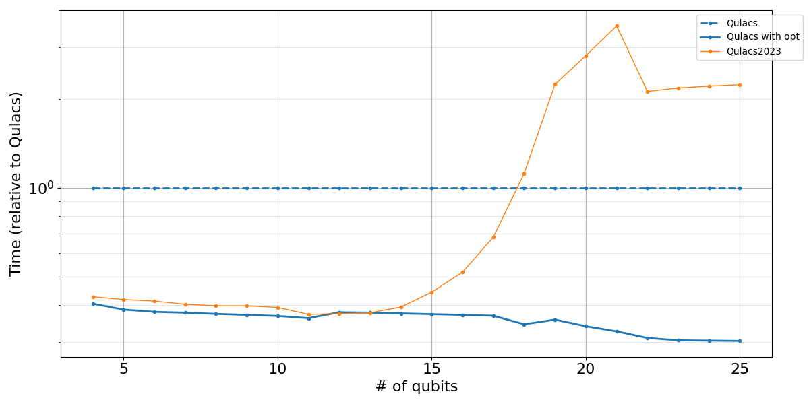

# Benchmark codes for Qulacs

Source codes for benchmarking the execution times of 10-layer random circuits with several numbers of qubits.

This repository shows a compoarison between [Qulacs](https://github.com/qulacs/qulacs/) and several popular existing quantum circuit simulators that have the interfaces of Python or Julia and support simulation with double-precision. 

Times are measured with single-thread, multi-thread, and GPU acceralation. If an option of circuit optimization such as gate fusion is provided, we check times with and without circuit optimization.

The benchmark codes are created based on [the benchmark project by Roger-luo](https://github.com/Roger-luo/quantum-benchmarks/).

The versions of installed libraries and relevant information are listed in the text files at `systeminfo`. The benchmark codes are saved in `benchmark` folder. The results are plotted in `image` folder by `plot.py`.

## Versions

CPU Benchmark environment 

|Name|Version|Note|
|:--|:--|:--|
|OS|CentOS7||
|CPU|Xeon CPU E5-2687W v4 @ 3.00GHz x 2|Hyperthreading is disabled|
|GCC|9.2.0||
|Python|3.7.9|
|NumPy|1.19.2|Backend is MKL 2020.2|
|Julia|1.5.2|

GPU Benchmark environment 

|Name|Version|Note|
|:--|:--|:--|
|OS|CentOS7||
|CPU|Xeon Silver 4108 CPU @ 1.80 GHz x 2|Hyperthreading is disabled|
|GPU|Tesla V100 PCIe 32GB|
|GCC|7.3.0||
|CUDA|10.2|
|Python|3.7.9|
|NumPy|1.19.2|Backend is MKL 2020.2|
|Julia|1.5.2|

Libraries

|Name|Version|Note|
|:--|:--|:--|
|[Intel-QS](https://github.com/iqusoft/intel-qs)|[latest master](https://github.com/iqusoft/intel-qs/tree/b625e1fb09c5aa3c146cb7129a2a29cdb6ff186a)|Installed with DIqsNative=ON|
|[ProjectQ](https://github.com/ProjectQ-Framework/ProjectQ)|0.5.1|
|[PyQuEST-cffi](https://github.com/HQSquantumsimulations/PyQuEST-cffi)|3.2.3.1|
|[Qibo](https://github.com/Quantum-TII/qibo)|0.1.1||
|[Qiskit-Aer(-gpu)](https://github.com/Qiskit/qiskit-aer)|0.7.1|Time for `backend._controller(qobj)` is evaluated|
|[Qulacs](https://github.com/qulacs/qulacs)|0.2.0|
|[qxelarator](https://github.com/QE-Lab/qx-simulator/tree/develop/qxelarator)|0.3.0|
|[Yao](https://github.com/QuantumBFS/Yao.jl)|0.6.3|

## Requirement
You need to install ``` pytest ``` and ``` pytest-benchmark``` via pip
## Result

### Single thread 


### Multi thread (24 cores)


### GPU acceralation


